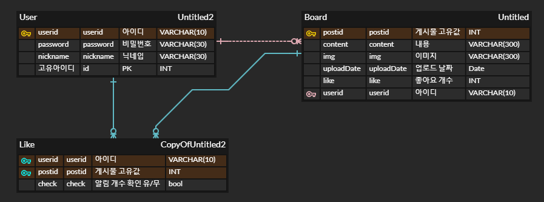

# NodeJS Magazine Server
프론트엔드와 함께 로그인 사용자용 매거진 사이트 만들기

## 👨‍💻 프로젝트 기간 
- 제작기간 : 2022-02-19 ~ 2022-02-23

___
## Getting Started

```
$ npm -ci
$ npx sequelize db:create
$ npx sequelize db:migrate
$ node app.js
```

## 🔨기술 스택
- NodeJS
- Express
- Sequelize
- JWT(Json Web Token)
- Docker
- Mysql
- AWS EC2

## 📋 DB ERD



## 📋 API 
- [API Document](./reference/API%20Docs.md)
